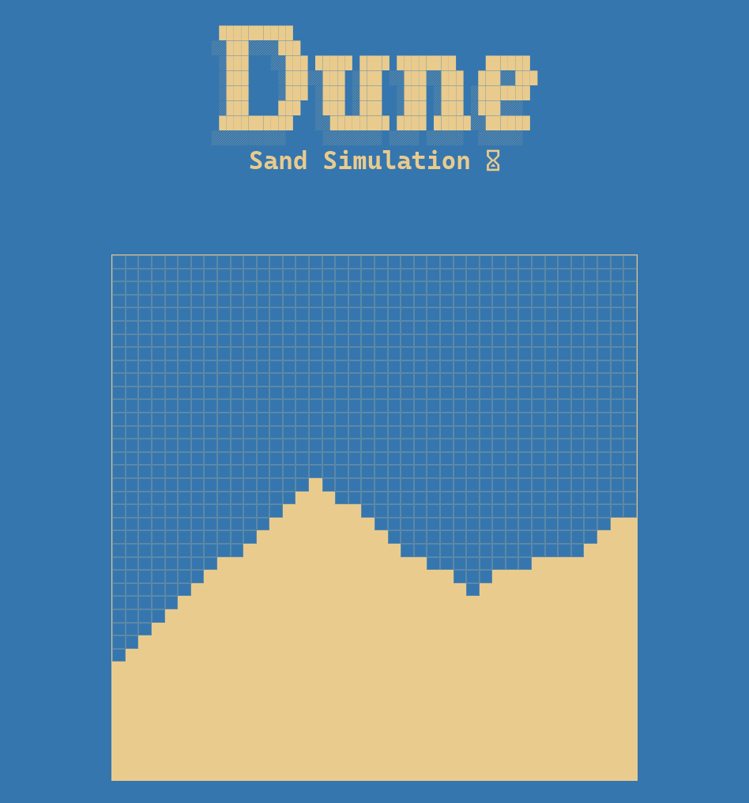

<h1 align='center'>Dune</h1>

A micro-project I built to better understand **cellular automata** and experiment with basic **graph algorithms** (although the core logic for a sand simulation is fairly straightforward).

## Todo List

This is a list of things I want to further explore with such a simulation

- [ ] A working sand hourglass with a custom timer
- [ ] Game of life automata
- [ ] Fix gravity, since currently everything just falls at the same time
- [ ] Explore more simulations like fire propagation or ant colony
- [ ] Ride Shai-Hulud.

## Screenshot

 

## Live Demo

https://dune-sand.netlify.app/
